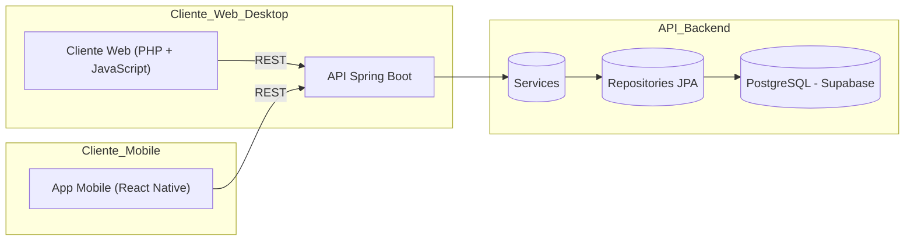

# Documentação Oficial do Projeto LaMusic

## 1. Visão Geral

**LaMusic** é um e-commerce de instrumentos musicais composto por três camadas principais:

1. **Banco de Dados PostgreSQL (Supabase)**
   - Armazena usuários, endereços, produtos, categorias, carrinhos, itens de carrinho, pedidos, itens de pedido, cupons e pagamentos.
2. **API Back-end em Java Spring Boot**
   - Realiza lógica de negócios, autenticação, autorização (RLS/Supabase Policies) e expõe endpoints REST.
3. **Cliente Mobile em React Native**
   - Consome endpoints da API para exibir catálogo, gerenciar carrinho, pedidos e, futuramente, módulo admin.

------

## 2. Arquitetura e System Design



**Deployment**:

- **Banco de Dados**: Supabase (PostgreSQL)
- **API Back-end**: Render.com via GitHub Actions (container Docker)
- **Cliente Web/Desktop**: desenvolvimento local em PHP + JavaScript; hospedagem futura a definir (ex.: Vercel, Netlify ou host PHP)
- **Cliente Mobile**: desenvolvimento local em React Native; distribuição futura via App Store / Play Store ou Expo

------

## 3. Schema de Banco de Dados

### 3.1 Diagrama ER (Mermaid)


### 3.2 Script SQL resumido


```sql
-- Habilitar extensão pgcrypto para UUIDs
CREATE EXTENSION IF NOT EXISTS "pgcrypto";

-- Exemplo da tabela users
CREATE TABLE users (
  id UUID PRIMARY KEY DEFAULT gen_random_uuid(),
  name TEXT NOT NULL,
  email TEXT UNIQUE NOT NULL,
  password TEXT NOT NULL,
  role TEXT NOT NULL DEFAULT 'customer' CHECK(role IN ('customer','admin')),
  created_at TIMESTAMPTZ NOT NULL DEFAULT now(),
  updated_at TIMESTAMPTZ NOT NULL DEFAULT now(),
  deleted_at TIMESTAMPTZ
);
-- Consulte /sql/schema.sql para o script completo
```

------

## 4. Estado Atual do MVP

- **Banco de Dados**: Schema refatorado com UUIDs, triggers de timestamps, tabelas novas (addresses, coupons, payments) e RLS pendente.
- **API Back-end**: Mapeamento JPA ainda no banco antigo (Long/IDENTITY), precisa migrar para UUID e novas entidades e relacionamentos.
- **Cliente Mobile**: Funcionalidades de login, listagem de produtos, carrinho e checkout implementadas.
- **Web Admin**: Protótipo de UI em React disponível; falta integração com API.

------

## 5. Backlog de Tarefas para MVP

| Nº   | Tarefa                                                       | Prioridade | Responsável     | Status       |
| ---- | ------------------------------------------------------------ | ---------- | --------------- | ------------ |
| 1    | Finalizar políticas RLS no Supabase                          | Alta       | Backend         | Em andamento |
| 2    | Migrar entidades JPA para novo schema (UUIDs e novas tabelas) | Alta       | Backend         | Pendente     |
| 3    | Expor endpoints para CRUD de `addresses`, `coupons`, `payments` | Alta       | Backend         | Pendente     |
| 4    | Implementar módulo Admin (Web & Mobile) para CRUD de produtos e categorias | Média      | Fullstack/Admin | Planejado    |
| 5    | Ajustar mobile para consumir novos endpoints  | Média      | Mobile          | Pendente     |
| 6    | Testes de integração e cobertura ≥ 80%                       | Baixa      | QA              | Não iniciado |
| 7    | Documentação Swagger/OpenAPI completa                        | Média      | Backend         | Não iniciado |
| 8    | Garantir deploy da API (Render via GitHub Actions)           | Alta       | DevOps/Backend  | Em produção  |
| 9    | Subir cliente Web (React Admin) em ambiente de hospedagem    | Alta      | Web             | Pendente     |
| 10   | Subir cliente Mobile (React Native) em ambiente de hospedagem | Alta      | Mobile/DevOps   | Pendente     |
| 11   | Analisar opções de hospedagem para Web e Mobile              | Baixa      | DevOps          | Planejado    |
| 12   | Rastrear alterações por user - Add campo Responsible          | Baixa      | Backend          | Planejado    |

------

## 6. Módulo Admin (Nova Feature)

### 6.1 Requisitos

- CRUD de **Produtos** (nome, descrição, preço, estoque, imagem, categorias).
- CRUD de **Categorias**.
- Autenticação: somente `role = admin` pode acessar.

### 6.2 Endpoints REST

- `GET    /admin/products`
- `POST   /admin/products`
- `PUT    /admin/products/{id}`
- `DELETE /admin/products/{id}`
- `GET    /admin/categories`
- `POST   /admin/categories`
- `PUT    /admin/categories/{id}`
- `DELETE /admin/categories/{id}`

> **Proteção**: usar RLS/Policies e/ou filtros de role na API.

### 6.3 UI

- **Web Admin** (React): Dashboard responsivo com tabelas e formulários.
- **Admin Mobile** (React Native): Telas de lista e detalhes/formulários.

------

## 7. Boas Práticas e Padrões

- **Versionamento**: GitFlow (`feature/*`, `develop`, `main`).
- **CI/CD**: GitHub Actions → build, test, deploy.
- **Documentação**: Swagger/OpenAPI; README no GitHub.
- **Testes**: Unitários (JUnit), integração (Testcontainers).
- **Monitoramento**: Logs centralizados (Supabase Logs, external ELK), métricas (Prometheus).
- **Segurança**: HTTPS, RLS no Supabase, validações no backend.

------

## 8. Links Úteis

- Repositório Back-end: https://github.com/vitorwhois/LaMusic
- Painel Supabase: https://app.supabase.com/project/...
- Swagger UI: https://api.lamusic.com/swagger-ui.html


-----

-----
# Documentação da API LaMusic

## 1. Introdução

### 1.1. URL Base

A URL base para todas as chamadas da API é: `http://localhost:8080` (ou a URL de produção quando aplicável).

### 1.2. Autenticação

A maioria dos endpoints da API (especialmente os prefixados com `/admin` ou que manipulam dados sensíveis do usuário) requer autenticação via **JSON Web Tokens (JWT)**.

- Para obter um token, utilize o endpoint `POST /auth/login`.
- Após obter o token, inclua-o em todas as requisições subsequentes no header `Authorization` com o prefixo `Bearer`.  
  **Exemplo**: `Authorization: Bearer SEU_TOKEN_JWT_AQUI`

### 1.3. Formato de Dados

Todas as requisições e respostas que envolvem um corpo de dados utilizam o formato **JSON**.

- Certifique-se de que o header `Content-Type` esteja definido como `application/json` para requisições com corpo.

### 1.4. Códigos de Status HTTP Comuns

- **200 OK**: Requisição bem-sucedida.
- **201 Created**: Recurso criado com sucesso.
- **204 No Content**: Requisição bem-sucedida, sem conteúdo para retornar (geralmente em operações de DELETE).
- **400 Bad Request**: A requisição está malformada, contém dados inválidos ou viola alguma regra de negócio na entrada.
- **401 Unauthorized**: Autenticação necessária ou falhou (token inválido ou ausente).
- **403 Forbidden**: O cliente autenticado não tem permissão para acessar o recurso.
- **404 Not Found**: O recurso solicitado não foi encontrado.
- **409 Conflict**: A requisição não pôde ser concluída devido a um conflito com o estado atual do recurso (ex: email já cadastrado).
- **500 Internal Server Error**: Um erro inesperado ocorreu no servidor.

---

## 2. Endpoints

### 2.1. Autenticação (/auth)

**Controller**: `AuthController.java`  
Responsável pelo registro e login de usuários.

#### 2.1.1. Login de Usuário

- **Descrição**: Autentica um usuário existente e retorna um token JWT.
- **Método HTTP e URL**: `POST /auth/login`
- **Autenticação**: Nenhuma.
- **Corpo da Requisição (Request Body)**: `com.LaMusic.dto.AuthRequest`
- **Corpo da Resposta (Response Body - Sucesso 200 OK)**: `com.LaMusic.dto.AuthResponse`
- **Respostas de Erro Comuns**:
  - **401 Unauthorized**: Credenciais inválidas (lançado pelo `AuthenticationManager`).
- **Regras de Negócio**:
  - O email e a senha devem corresponder a um usuário cadastrado no sistema.
  - O `AuthenticationManager` valida as credenciais.
  - Se a autenticação for bem-sucedida, um token JWT é gerado usando `UserDetailsServiceImpl` e `JwtUtil`.
- **Consumo pelo Frontend**:
  - Enviar `email` e `password` no corpo da requisição.
  - Armazenar o token JWT recebido (ex: `localStorage`, `sessionStorage`, ou gerenciador de estado) para ser usado no header `Authorization` de requisições subsequentes a endpoints protegidos.

#### 2.1.2. Registrar Novo Cliente

- **Descrição**: Registra um novo usuário com o papel (role) `USER`.
- **Método HTTP e URL**: `POST /auth/register`
- **Autenticação**: Nenhuma.
- **Corpo da Requisição (Request Body)**: `com.LaMusic.dto.RegisterRequest`
- **Corpo da Resposta (Response Body - Sucesso 200 OK)**: `com.LaMusic.dto.AuthResponse`
- **Respostas de Erro Comuns**:
  - **500 Internal Server Error** (se a `RuntimeException` "E-mail já cadastrado." não for tratada por um `GlobalExceptionHandler` para retornar um status mais específico como **409 Conflict**).
- **Regras de Negócio**:
  - O email fornecido não deve existir no banco de dados. Se existir, lança `RuntimeException`.
  - A senha é codificada usando `PasswordEncoder` antes de ser salva.
  - O usuário é criado com `Role.USER` e `email_verified` como `false`.
  - Um token JWT é gerado e retornado para o usuário recém-registrado.
- **Consumo pelo Frontend**:
  - Coletar dados do formulário de registro.
  - Enviar os dados.
  - Após o sucesso, o frontend pode logar o usuário automaticamente usando o token retornado ou redirecioná-lo para a página de login.

#### 2.1.3. Registrar Novo Administrador

- **Descrição**: Registra um novo usuário com o papel (role) `ADMIN`.
- **Método HTTP e URL**: `POST /auth/register-admin`
- **Autenticação**: Nenhuma (*Idealmente, este endpoint deveria ser protegido e acessível apenas por outros administradores ou através de um processo seguro*).
- **Corpo da Requisição (Request Body)**: `com.LaMusic.dto.RegisterRequest`
- **Corpo da Resposta (Response Body - Sucesso 200 OK)**: `com.LaMusic.dto.AuthResponse`
- **Respostas de Erro Comuns**:
  - **500 Internal Server Error** (se a `RuntimeException` "E-mail já cadastrado." não for tratada).
- **Regras de Negócio**:
  - Similar ao registro de cliente, mas o usuário é criado com `Role.ADMIN`.
  - *Consideração de Segurança*: Permitir o registro de administradores por um endpoint público é um risco de segurança. Este endpoint deve ser protegido.
- **Consumo pelo Frontend**:
  - Geralmente não consumido diretamente por um frontend público. Deve ser usado por uma interface administrativa protegida.

---

### 2.2. Usuários (Administração) (/admin/users)

**Controller**: `UserController.java`  
Endpoints para administradores gerenciarem usuários.

#### 2.2.1. Listar Todos os Usuários

- **Descrição**: Retorna uma lista de todos os usuários não deletados (soft delete).
- **Método HTTP e URL**: `GET /admin/users`
- **Autenticação**: Requerida (Token JWT com permissão de administrador, ex: `ROLE_ADMIN`).
- **Corpo da Resposta (Response Body - Sucesso 200 OK)**: Lista de `com.LaMusic.dto.UserDTO`
- **Regras de Negócio**:
  - Filtra usuários que não foram marcados com `deletedAt` (soft delete).
  - Mapeia entidades `User` para `UserDTO`.
- **Consumo pelo Frontend**:
  - Enviar requisição GET com o token de admin no header `Authorization`.
  - Exibir a lista de usuários em uma tabela ou interface similar.

#### 2.2.2. Obter Usuário por ID

- **Descrição**: Retorna os detalhes de um usuário específico (entidade completa).
- **Método HTTP e URL**: `GET /admin/users/{id}`
- **Autenticação**: Requerida (Token JWT com permissão de administrador).
- **Parâmetros de URL**:
  - `id` (UUID, Obrigatório): ID do usuário a ser recuperado.
- **Corpo da Resposta (Response Body - Sucesso 200 OK)**: `com.LaMusic.entity.User`
- **Respostas de Erro Comuns**:
  - **404 Not Found**: Se o usuário com o ID fornecido não existir ou estiver deletado (soft delete). (*Atualmente lança `RuntimeException` que pode resultar em 500 se não tratada*).
- **Regras de Negócio**:
  - Busca o usuário pelo ID.
  - Filtra para não retornar usuários com `deletedAt` preenchido.
- **Consumo pelo Frontend**:
  - Enviar requisição GET com o token de admin e o ID do usuário na URL.
  - Exibir os detalhes do usuário.

#### 2.2.3. Criar Novo Usuário (Administração)

- **Descrição**: Cria um novo usuário com dados e role especificados.
- **Método HTTP e URL**: `POST /admin/users`
- **Autenticação**: Requerida (Token JWT com permissão de administrador).
- **Corpo da Requisição (Request Body)**: `com.LaMusic.dto.CreateUserRequest`
- **Corpo da Resposta (Response Body - Sucesso 200 OK)**: `com.LaMusic.dto.UserDTO`
- **Respostas de Erro Comuns**:
  - **400 Bad Request**: Se dados obrigatórios estiverem faltando ou forem inválidos.
  - **409 Conflict**: Se o email já existir (se o `UserService` for modificado para lançar uma exceção específica tratada como 409).
- **Regras de Negócio**:
  - O email não deve existir (embora não haja verificação explícita neste método, o banco de dados pode impor unicidade).
  - A senha é codificada.
  - `email_verified` é definido como `false`.
- **Consumo pelo Frontend**:
  - Interface administrativa para criar usuários.
  - Enviar dados do novo usuário com o token de admin.

#### 2.2.4. Atualizar Usuário

- **Descrição**: Atualiza os dados de um usuário existente.
- **Método HTTP e URL**: `PUT /admin/users/{id}`
- **Autenticação**: Requerida (Token JWT com permissão de administrador).
- **Parâmetros de URL**:
  - `id` (UUID, Obrigatório): ID do usuário a ser atualizado.
- **Corpo da Requisição (Request Body)**: `com.LaMusic.dto.UpdateUserRequest`
- **Corpo da Resposta (Response Body - Sucesso 200 OK)**: `com.LaMusic.dto.UserDTO`
- **Respostas de Erro Comuns**:
  - **404 Not Found**: Se o usuário com o ID fornecido não existir ou estiver deletado. (*Atualmente lança `RuntimeException`*).
- **Regras de Negócio**:
  - Busca o usuário pelo ID (não deletado).
  - Atualiza os campos `name`, `phone`, `role` se fornecidos no request.
  - Email e senha não são atualizados por este endpoint/DTO.
- **Consumo pelo Frontend**:
  - Interface administrativa para editar usuários.
  - Enviar apenas os campos a serem modificados.

#### 2.2.5. Deletar Usuário (Soft Delete)

- **Descrição**: Marca um usuário como deletado (soft delete).
- **Método HTTP e URL**: `DELETE /admin/users/{id}`
- **Autenticação**: Requerida (Token JWT com permissão de administrador).
- **Parâmetros de URL**:
  - `id` (UUID, Obrigatório): ID do usuário a ser deletado.
- **Corpo da Resposta (Response Body - Sucesso 200 OK ou 204 No Content)**: Nenhum.
- **Respostas de Erro Comuns**:
  - **404 Not Found**: Se o usuário com o ID fornecido não existir ou já estiver deletado. (*Atualmente lança `RuntimeException`*).
- **Regras de Negócio**:
  - Busca o usuário pelo ID (não deletado).
  - Define o campo `deletedAt` para a data/hora atual.
  - O usuário não é removido fisicamente do banco.
- **Consumo pelo Frontend**:
  - Botão de "deletar" na interface de administração de usuários.
  - Após a deleção, o usuário não deve mais aparecer nas listagens padrão.

---

### 2.3. Perfil do Cliente (/client)

**Controller**: `ClientController.java`  
Endpoints para o usuário logado gerenciar seu próprio perfil.

#### 2.3.1. Obter Meu Perfil

- **Descrição**: Retorna os dados do perfil do usuário autenticado.
- **Método HTTP e URL**: `GET /client/me`
- **Autenticação**: Requerida (Token JWT do próprio usuário, `ROLE_USER` é verificado via `@PreAuthorize`).
- **Corpo da Resposta (Response Body - Sucesso 200 OK)**: `com.LaMusic.dto.UserDTO`
- **Respostas de Erro Comuns**:
  - **401 Unauthorized**: Se o token for inválido ou ausente.
  - **403 Forbidden**: Se o usuário não tiver `ROLE_USER` (embora o token já deva ser de um usuário).
  - **404 Not Found**: Se o usuário associado ao token não for encontrado no banco (improvável se o token for válido).
- **Regras de Negócio**:
  - Obtém o email do usuário a partir do `UserDetails` (token JWT).
  - Busca o usuário no repositório pelo email.
  - Mapeia para `UserDTO`.
- **Consumo pelo Frontend**:
  - Requisição para carregar dados do perfil do usuário.
  - Enviar o token do usuário logado no header `Authorization`.

#### 2.3.2. Atualizar Meu Perfil

- **Descrição**: Permite que o usuário autenticado atualize seus próprios dados de perfil.
- **Método HTTP e URL**: `PUT /client/me`
- **Autenticação**: Requerida (Token JWT do próprio usuário, `ROLE_USER`).
- **Corpo da Requisição (Request Body)**: `com.LaMusic.dto.UpdateUserRequest`  
  *Nota*: Permitir que o usuário altere a própria `role` via este DTO pode ser um risco de segurança se não houver validação adicional. Geralmente, a `role` não é incluída ou é ignorada no `UpdateUserRequest` para o próprio usuário.
- **Corpo da Resposta (Response Body - Sucesso 200 OK)**: `com.LaMusic.dto.UserDTO`
- **Respostas de Erro Comuns**:
  - **401 Unauthorized**, **403 Forbidden**, **404 Not Found**.
- **Regras de Negócio**:
  - Obtém o usuário autenticado.
  - Atualiza `name` e `phone`. A atualização de `role` é permitida pelo código, mas deve ser usada com cautela.
- **Consumo pelo Frontend**:
  - Formulário de edição de perfil.
  - Enviar apenas os campos que o usuário deseja alterar.

#### 2.3.3. Deletar Minha Conta (Soft Delete)

- **Descrição**: Permite que o usuário autenticado marque sua própria conta como deletada.
- **Método HTTP e URL**: `DELETE /client/me`
- **Autenticação**: Requerida (Token JWT do próprio usuário, `ROLE_USER`).
- **Corpo da Resposta (Response Body - Sucesso 200 OK ou 204 No Content)**: Nenhum.
- **Respostas de Erro Comuns**:
  - **401 Unauthorized**, **403 Forbidden**, **404 Not Found**.
- **Regras de Negócio**:
  - Obtém o usuário autenticado.
  - Realiza o soft delete (define `deletedAt`).
- **Consumo pelo Frontend**:
  - Opção "Excluir minha conta" no perfil do usuário.
  - Requer confirmação do usuário. Após a exclusão, o usuário deve ser deslogado e não conseguir mais acessar com essa conta.

---

### 2.4. Produtos (Administração) (/admin/products)

**Controller**: `ProductController.java`  
Endpoints para administradores gerenciarem produtos.

#### 2.4.1. Criar Produto

- **Descrição**: Cria um novo produto.
- **Método HTTP e URL**: `POST /admin/products`
- **Autenticação**: Requerida (Token JWT com permissão de administrador).
- **Corpo da Requisição (Request Body)**: `com.LaMusic.dto.ProductDTO`
- **Corpo da Resposta (Response Body - Sucesso 201 Created)**: `com.LaMusic.dto.ProductDTO` (com ID e timestamps gerados)
- **Respostas de Erro Comuns**:
  - **400 Bad Request**: Se dados obrigatórios (ex: `name`, `price`, `stockQuantity`) estiverem faltando ou se `categoryIds` contiver UUIDs de categorias inexistentes.
- **Regras de Negócio**:
  - Busca as categorias pelos `categoryIds` fornecidos.
  - Mapeia o `ProductDTO` para a entidade `Product` usando `ProductMapper`.
  - Associa as imagens ao produto.
  - Salva o novo produto no banco.
- **Consumo pelo Frontend**:
  - Formulário de criação de produto na interface administrativa.
  - Permitir upload de imagens e seleção de categorias.

#### 2.4.2. Listar Todos os Produtos

- **Descrição**: Retorna uma lista de todos os produtos.
- **Método HTTP e URL**: `GET /admin/products`
- **Autenticação**: Requerida (Token JWT com permissão de administrador).
- **Corpo da Resposta (Response Body - Sucesso 200 OK)**: Lista de `com.LaMusic.dto.ProductDTO`
- **Regras de Negócio**:
  - Busca todos os produtos no repositório.
  - Mapeia cada entidade `Product` para `ProductDTO`.
- **Consumo pelo Frontend**:
  - Exibir lista de produtos na interface administrativa, com opções de filtro, paginação, etc.

#### 2.4.3. Obter Produto por ID

- **Descrição**: Retorna os detalhes de um produto específico.
- **Método HTTP e URL**: `GET /admin/products/{id}`
- **Autenticação**: Requerida (Token JWT com permissão de administrador).
- **Parâmetros de URL**:
  - `id` (UUID, Obrigatório): ID do produto.
- **Corpo da Resposta (Response Body - Sucesso 200 OK)**: `com.LaMusic.dto.ProductDTO`
- **Respostas de Erro Comuns**:
  - **404 Not Found**: Se o produto com o ID fornecido não existir. (*Atualmente lança `RuntimeException`*).
- **Regras de Negócio**:
  - Busca o produto pelo ID.
  - Mapeia para `ProductDTO`.
- **Consumo pelo Frontend**:
  - Visualizar detalhes de um produto específico ou carregar dados para um formulário de edição.

#### 2.4.4. Atualizar Produto

- **Descrição**: Atualiza os dados de um produto existente.
- **Método HTTP e URL**: `PUT /admin/products/{id}`
- **Autenticação**: Requerida (Token JWT com permissão de administrador).
- **Parâmetros de URL**:
  - `id` (UUID, Obrigatório): ID do produto a ser atualizado.
- **Corpo da Requisição (Request Body)**: `com.LaMusic.dto.ProductDTO` (similar ao de criação, mas o id no corpo é geralmente ignorado em favor do id da URL)
- **Corpo da Resposta (Response Body - Sucesso 200 OK)**: `com.LaMusic.dto.ProductDTO` (com os dados atualizados)
- **Respostas de Erro Comuns**:
  - **404 Not Found**: Se o produto com o ID da URL não existir. (*Atualmente lança `RuntimeException`*).
  - **400 Bad Request**: Se `categoryIds` contiver UUIDs de categorias inexistentes.
- **Regras de Negócio**:
  - Busca o produto existente pelo ID.
  - Busca as categorias pelos `categoryIds` fornecidos.
  - Mapeia o `ProductDTO` recebido para uma nova entidade `Product` (ou atualiza os campos da existente). O `ProductMapper.toEntity` cria uma nova instância, e o ID da existente é setado nela.
  - Salva o produto atualizado.
- **Consumo pelo Frontend**:
  - Formulário de edição de produto. Enviar todos os campos do produto, mesmo os não alterados, ou apenas os alterados dependendo da implementação do backend (aqui parece que uma nova entidade é mapeada, então enviar todos os campos é mais seguro).

#### 2.4.5. Deletar Produto

- **Descrição**: Remove um produto do sistema.
- **Método HTTP e URL**: `DELETE /admin/products/{id}`
- **Autenticação**: Requerida (Token JWT com permissão de administrador).
- **Parâmetros de URL**:
  - `id` (UUID, Obrigatório): ID do produto a ser deletado.
- **Corpo da Resposta (Response Body - Sucesso 204 No Content)**: Nenhum.
- **Respostas de Erro Comuns**:
  - **404 Not Found**: Se o produto não existir (o `deleteById` do Spring Data JPA não lança exceção por padrão se a entidade não existe, mas o comportamento pode ser customizado).
- **Regras de Negócio**:
  - Deleta o produto do banco de dados (hard delete, pois usa `productRepository.deleteById(id)`).
  - *Consideração*: Se houver pedidos associados a este produto, um hard delete pode causar problemas de integridade referencial ou perda de histórico. Um soft delete (marcar como `deletedAt` ou `status = "ARCHIVED"`) pode ser mais apropriado.
- **Consumo pelo Frontend**:
  - Botão "Deletar Produto" na interface administrativa.
  - Requer confirmação.

---

### 2.5. Endereços (/addresses)

**Controller**: `AddressController.java`  
Endpoints para gerenciar endereços de usuários.

#### 2.5.1. Listar Endereços por Usuário

- **Descrição**: Retorna todos os endereços associados a um ID de usuário específico.
- **Método HTTP e URL**: `GET /addresses/user/{userId}`
- **Autenticação**: Requerida (Token JWT. O usuário logado só deveria poder ver seus próprios endereços, ou um admin ver qualquer um. A lógica de permissão precisa ser clara aqui).
- **Parâmetros de URL**:
  - `userId` (UUID, Obrigatório): ID do usuário cujos endereços serão listados.
- **Corpo da Resposta (Response Body - Sucesso 200 OK)**: Lista de `com.LaMusic.dto.AddressDTO`
- **Regras de Negócio**:
  - Busca endereços no `addressRepository` filtrando por `userId`.
  - Mapeia cada entidade `Address` para `AddressDTO`.
- **Consumo pelo Frontend**:
  - Na seção "Meus Endereços" do perfil do usuário.
  - Um administrador também pode usar para ver os endereços de um usuário específico.

#### 2.5.2. Obter Endereço por ID

- **Descrição**: Retorna os detalhes de um endereço específico.
- **Método HTTP e URL**: `GET /addresses/{id}`
- **Autenticação**: Requerida (Token JWT. Permissão para ver o endereço específico).
- **Parâmetros de URL**:
  - `id` (UUID, Obrigatório): ID do endereço.
- **Corpo da Resposta (Response Body - Sucesso 200 OK)**: `com.LaMusic.dto.AddressDTO`
- **Respostas de Erro Comuns**:
  - **404 Not Found**: Se o endereço não for encontrado. (*Atualmente lança `RuntimeException`*).
- **Regras de Negócio**:
  - Busca o endereço pelo ID.
  - Mapeia para `AddressDTO`.
- **Consumo pelo Frontend**:
  - Carregar dados de um endereço para visualização ou edição.

#### 2.5.3. Criar Novo Endereço

- **Descrição**: Cria um novo endereço para um usuário.
- **Método HTTP e URL**: `POST /addresses`
- **Autenticação**: Requerida (Token JWT do usuário que está criando o endereço para si, ou de um admin).
- **Corpo da Requisição (Request Body)**: `com.LaMusic.dto.AddressDTO`
- **Corpo da Resposta (Response Body - Sucesso 201 Created)**: `com.LaMusic.dto.AddressDTO` (com ID gerado)
- **Respostas de Erro Comuns**:
  - **404 Not Found**: Se o `userId` fornecido no corpo não corresponder a um usuário existente. (*Atualmente lança `RuntimeException`*).
- **Regras de Negócio**:
  - Verifica se o `userId` existe.
  - Mapeia `AddressDTO` para a entidade `Address`, associando ao `User` encontrado.
  - Salva o novo endereço.
- **Consumo pelo Frontend**:
  - Formulário de adição de novo endereço no perfil do usuário ou durante o checkout.

#### 2.5.4. Atualizar Endereço

- **Descrição**: Atualiza um endereço existente.
- **Método HTTP e URL**: `PUT /addresses/{id}`
- **Autenticação**: Requerida (Token JWT do dono do endereço ou de um admin).
- **Parâmetros de URL**:
  - `id` (UUID, Obrigatório): ID do endereço a ser atualizado.
- **Corpo da Requisição (Request Body)**: `com.LaMusic.dto.AddressDTO` (o `userId` no corpo geralmente é ignorado ou deve corresponder ao usuário do endereço existente)
- **Corpo da Resposta (Response Body - Sucesso 200 OK)**: `com.LaMusic.dto.AddressDTO` (com dados atualizados)
- **Respostas de Erro Comuns**:
  - **404 Not Found**: Se o endereço com o ID da URL não existir. (*Atualmente lança `RuntimeException`*).
- **Regras de Negócio**:
  - Busca o endereço existente pelo ID.
  - Atualiza todos os campos da entidade `Address` com os valores do `AddressDTO` recebido.
  - Salva o endereço atualizado.
- **Consumo pelo Frontend**:
  - Formulário de edição de endereço.

#### 2.5.5. Deletar Endereço

- **Descrição**: Remove um endereço.
- **Método HTTP e URL**: `DELETE /addresses/{id}`
- **Autenticação**: Requerida (Token JWT do dono do endereço ou de um admin).
- **Parâmetros de URL**:
  - `id` (UUID, Obrigatório): ID do endereço a ser deletado.
- **Corpo da Resposta (Response Body - Sucesso 204 No Content)**: Nenhum.
- **Respostas de Erro Comuns**:
  - **404 Not Found**: Se o endereço não existir (comportamento padrão do `deleteById`).
- **Regras de Negócio**:
  - Deleta o endereço do banco (hard delete).
- **Consumo pelo Frontend**:
  - Botão "Remover Endereço".

---

### 2.6. Carrinho de Compras (/cart)

**Controller**: `CartController.java`  
Endpoints para gerenciar o carrinho de compras do usuário.

#### 2.6.1. Adicionar Item ao Carrinho

- **Descrição**: Adiciona um produto ao carrinho do usuário ou incrementa sua quantidade se já existir.
- **Método HTTP e URL**: `POST /cart/add`
- **Autenticação**: Requerida (Token JWT do usuário).
- **Corpo da Requisição (Request Body)**: `com.LaMusic.dto.AddCartDTO`
- **Corpo da Resposta (Response Body - Sucesso 200 OK)**: `com.LaMusic.entity.Cart` (representação completa do carrinho atualizado)
- **Respostas de Erro Comuns**:
  - **400 Bad Request**: Se `userId`, `productId` ou `quantity` forem nulos ou inválidos (ex: `quantity <= 0`).
  - **404 Not Found**: Se o `userId` ou `productId` não existirem. (*Atualmente lança `RuntimeException`*).
- **Regras de Negócio**:
  - Encontra ou cria um carrinho para o `userId`.
  - Verifica se o `productId` existe.
  - Se o produto já está no carrinho, incrementa a quantidade.
  - Se não está, cria um novo `CartItem`.
  - O preço do item no carrinho (`CartItem.price`) é o preço do produto no momento da adição.
  - Salva o `CartItem` e o `Cart`.
- **Consumo pelo Frontend**:
  - Botão "Adicionar ao Carrinho" na página de produto ou listagem.
  - Enviar `userId` (do usuário logado), `productId` e `quantity`.

#### 2.6.2. Limpar Carrinho

- **Descrição**: Remove todos os itens do carrinho de um usuário.
- **Método HTTP e URL**: `DELETE /cart/clear/{userId}`
- **Autenticação**: Requerida (Token JWT do usuário dono do carrinho ou de um admin).
- **Parâmetros de URL**:
  - `userId` (UUID, Obrigatório): ID do usuário cujo carrinho será limpo.
- **Corpo da Resposta (Response Body - Sucesso 204 No Content)**: Nenhum.
- **Respostas de Erro Comuns**:
  - **404 Not Found**: Se o carrinho para o `userId` não for encontrado. (*Atualmente lança `RuntimeException`*).
- **Regras de Negócio**:
  - Encontra o carrinho pelo `userId`.
  - Deleta todos os `CartItem` associados a esse carrinho.
- **Consumo pelo Frontend**:
  - Botão "Limpar Carrinho" na página do carrinho.

#### 2.6.3. Obter Itens do Carrinho por ID do Carrinho

- **Descrição**: Lista todos os itens de um carrinho específico.
- **Método HTTP e URL**: `GET /cart/{cartId}`
- **Autenticação**: Requerida (Token JWT do usuário dono do carrinho ou de um admin).
- **Parâmetros de URL**:
  - `cartId` (UUID, Obrigatório): ID do carrinho.
- **Corpo da Resposta (Response Body - Sucesso 200 OK)**: Lista de `com.LaMusic.entity.CartItem`
- **Regras de Negócio**:
  - Busca os `CartItem` filtrando por `cartId`.
- **Consumo pelo Frontend**:
  - Para exibir os itens na página do carrinho. O frontend geralmente obterá o `cartId` primeiro buscando o carrinho do usuário (ex: através de um endpoint `GET /cart/user/{userId}` que não existe atualmente, mas `findOrCreateCartByUserId` é usado internamente).

---

### 2.7. Pedidos (/orders)

**Controller**: `OrderController.java`  
Endpoints para gerenciar pedidos.

#### 2.7.1. Realizar Pedido

- **Descrição**: Cria um novo pedido a partir do carrinho do usuário e dos endereços fornecidos.
- **Método HTTP e URL**: `POST /orders/place`
- **Autenticação**: Requerida (Token JWT do usuário).
- **Query Parameters**:
  - `userId` (UUID, Obrigatório): ID do usuário realizando o pedido.
  - `shippingAddressId` (UUID, Obrigatório): ID do endereço de entrega.
  - `billingAddressId` (UUID, Obrigatório): ID do endereço de cobrança.
- **Corpo da Resposta (Response Body - Sucesso 200 OK)**: `com.LaMusic.dto.OrderResponseDTO`
- **Respostas de Erro Comuns**:
  - **404 Not Found**: Se `userId`, `shippingAddressId`, `billingAddressId` não existirem, ou se o carrinho do usuário estiver vazio. (*Atualmente lança `RuntimeException` ou `EntityNotFoundException`*).
- **Regras de Negócio**:
  - Busca o carrinho do `userId`.
  - Busca os endereços de entrega e cobrança pelos IDs fornecidos.
  - Cria `OrderAddress` a partir das entidades `Address`.
  - Cria uma nova entidade `Order`.
  - Para cada item no carrinho:
    - Cria um `OrderItem`.
    - Decrementa o estoque do produto (`product.setStockQuantity(product.getStockQuantity() - cartItem.getQuantity())`).
    - A chamada `productService.updateProductStock(product)` está como TODO, mas a lógica de decrementar está presente. É crucial que essa atualização de estoque seja persistida.
  - Calcula o `totalAmount` do pedido.
  - Salva o pedido.
  - Deleta o carrinho do usuário (`cartService.deleteCart(cart)`).
  - Mapeia o `Order` para `OrderResponseDTO`.
- **Consumo pelo Frontend**:
  - No final do processo de checkout.
  - O frontend precisa fornecer os IDs do usuário, endereço de entrega e endereço de cobrança (selecionados previamente pelo usuário).

#### 2.7.2. Listar Pedidos por Usuário

- **Descrição**: Retorna uma lista de todos os pedidos feitos por um usuário específico.
- **Método HTTP e URL**: `GET /orders/user/{userId}`
- **Autenticação**: Requerida (Token JWT do usuário dono dos pedidos ou de um admin).
- **Parâmetros de URL**:
  - `userId` (UUID, Obrigatório): ID do usuário.
- **Corpo da Resposta (Response Body - Sucesso 200 OK)**: Lista de `com.LaMusic.entity.Order` (entidade completa)
- **Regras de Negócio**:
  - Busca todos os pedidos filtrando por `userId`.
- **Consumo pelo Frontend**:
  - Na seção "Meus Pedidos" do perfil do usuário.

---

### 2.8. Cupons (/coupons)

**Controller**: `CouponController.java`  
Endpoints para gerenciar cupons de desconto. (*Presumivelmente para administradores, mas a rota não tem `/admin`*).

#### 2.8.1. Listar Todos os Cupons

- **Descrição**: Retorna uma lista de todos os cupons.
- **Método HTTP e URL**: `GET /coupons`
- **Autenticação**: Requerida (*Presumivelmente Admin*).
- **Corpo da Resposta (Response Body - Sucesso 200 OK)**: Lista de `com.LaMusic.dto.CouponDTO`
- **Regras de Negócio**:
  - Busca todos os cupons e mapeia para DTO.
- **Consumo pelo Frontend**:
  - Interface administrativa para listar e gerenciar cupons.

#### 2.8.2. Obter Cupom por ID

- **Descrição**: Retorna detalhes de um cupom específico.
- **Método HTTP e URL**: `GET /coupons/{id}`
- **Autenticação**: Requerida (*Presumivelmente Admin*).
- **Parâmetros de URL**: `id` (UUID).
- **Corpo da Resposta (Response Body - Sucesso 200 OK)**: `com.LaMusic.dto.CouponDTO`
- **Respostas de Erro Comuns**: **404 Not Found**.
- **Regras de Negócio**: Busca e mapeia o cupom.

#### 2.8.3. Criar Cupom

- **Descrição**: Cria um novo cupom.
- **Método HTTP e URL**: `POST /coupons`
- **Autenticação**: Requerida (*Presumivelmente Admin*).
- **Corpo da Requisição (Request Body)**: `com.LaMusic.dto.CouponDTO` (sem `id`, `usedCount`, `createdAt`, `updatedAt`)
- **Corpo da Resposta (Response Body - Sucesso 201 Created)**: `com.LaMusic.dto.CouponDTO` (com campos gerados).
- **Regras de Negócio**:
  - Mapeia DTO para entidade.
  - Define `createdAt` e `updatedAt`.
  - Salva o cupom.
- **Consumo pelo Frontend**: Interface administrativa.

#### 2.8.4. Atualizar Cupom

- **Descrição**: Atualiza um cupom existente.
- **Método HTTP e URL**: `PUT /coupons/{id}`
- **Autenticação**: Requerida (*Presumivelmente Admin*).
- **Parâmetros de URL**: `id` (UUID).
- **Corpo da Requisição (Request Body)**: `com.LaMusic.dto.CouponDTO` (com todos os campos a serem atualizados).
- **Corpo da Resposta (Response Body - Sucesso 200 OK)**: `com.LaMusic.dto.CouponDTO` (atualizado).
- **Respostas de Erro Comuns**: **404 Not Found**.
- **Regras de Negócio**:
  - Busca o cupom.
  - Atualiza os campos.
  - Define `updatedAt`.
  - Salva.
- **Consumo pelo Frontend**: Interface administrativa.

#### 2.8.5. Deletar Cupom

- **Descrição**: Remove um cupom.
- **Método HTTP e URL**: `DELETE /coupons/{id}`
- **Autenticação**: Requerida (*Presumivelmente Admin*).
- **Parâmetros de URL**: `id` (UUID).
- **Corpo da Resposta (Response Body - Sucesso 204 No Content)**: Nenhum.
- **Regras de Negócio**: Hard delete do cupom.

---

### 2.9. Pagamentos (/payments)

**Controller**: `PaymentController.java`  
Endpoints para gerenciar informações de pagamento. (*Presumivelmente para administradores ou sistema interno*).

#### 2.9.1. Listar Todos os Pagamentos

- **Descrição**: Retorna uma lista de todos os pagamentos.
- **Método HTTP e URL**: `GET /payments`
- **Autenticação**: Requerida (*Presumivelmente Admin*).
- **Corpo da Resposta (Response Body - Sucesso 200 OK)**: Lista de `com.LaMusic.dto.PaymentDTO`
- **Regras de Negócio**: Busca todos os pagamentos e mapeia para DTO.
- **Consumo pelo Frontend**: Interface administrativa para visualização de pagamentos.

#### 2.9.2. Obter Pagamento por ID

- **Descrição**: Retorna detalhes de um pagamento específico.
- **Método HTTP e URL**: `GET /payments/{id}`
- **Autenticação**: Requerida (*Presumivelmente Admin*).
- **Parâmetros de URL**: `id` (UUID).
- **Corpo da Resposta (Response Body - Sucesso 200 OK)**: `com.LaMusic.dto.PaymentDTO`.
- **Respostas de Erro Comuns**: **404 Not Found**.

#### 2.9.3. Criar Pagamento

- **Descrição**: Registra um novo pagamento (geralmente acionado internamente após um pedido ou por um gateway de pagamento).
- **Método HTTP e URL**: `POST /payments`
- **Autenticação**: Requerida (Sistema interno ou Admin).
- **Corpo da Requisição (Request Body)**: `com.LaMusic.dto.PaymentDTO` (sem `id`, `createdAt`)
- **Corpo da Resposta (Response Body - Sucesso 201 Created)**: `com.LaMusic.dto.PaymentDTO` (com campos gerados).
- **Respostas de Erro Comuns**: **404 Not Found** se `orderId` não existir.
- **Regras de Negócio**:
  - Associa ao pedido (`orderId`).
  - Define `createdAt`.
  - Salva o pagamento.
- **Consumo pelo Frontend**: Geralmente não diretamente. Pode ser usado por um webhook de gateway de pagamento ou por um processo de backend.

#### 2.9.4. Atualizar Pagamento

- **Descrição**: Atualiza o status ou outros detalhes de um pagamento.
- **Método HTTP e URL**: `PUT /payments/{id}`
- **Autenticação**: Requerida (Sistema interno ou Admin).
- **Parâmetros de URL**: `id` (UUID).
- **Corpo da Requisição (Request Body)**: `com.LaMusic.dto.PaymentDTO` (com campos a serem atualizados).
- **Corpo da Resposta (Response Body - Sucesso 200 OK)**: `com.LaMusic.dto.PaymentDTO` (atualizado).
- **Respostas de Erro Comuns**: **404 Not Found**.
- **Regras de Negócio**: Atualiza os campos do pagamento.
- **Consumo pelo Frontend**: Geralmente não diretamente.

#### 2.9.5. Deletar Pagamento

- **Descrição**: Remove um registro de pagamento (*usar com extrema cautela*).
- **Método HTTP e URL**: `DELETE /payments/{id}`
- **Autenticação**: Requerida (*Presumivelmente Admin*).
- **Parâmetros de URL**: `id` (UUID).
- **Corpo da Resposta (Response Body - Sucesso 204 No Content)**: Nenhum.
- **Regras de Negócio**: Hard delete. *Consideração*: Deletar registros de pagamento raramente é uma boa prática. É melhor marcá-los como inválidos ou cancelados.

---

### 2.10. Categorias (/categories)

**Controller**: `CategoryController.java` (*Assumindo que será criado, baseado nos serviços e DTOs*)  
Endpoints para gerenciar categorias de produtos. (*Presumivelmente para administradores*).

*Nota*: Como o `CategoryController.java` está vazio, os endpoints abaixo são inferidos com base no `CategoryService.java` e `CategoryDTO.java` e no padrão dos outros controllers.

#### 2.10.1. Listar Todas as Categorias

- **Descrição**: Retorna uma lista de todas as categorias.
- **Método HTTP e URL**: `GET /categories` (ou `GET /admin/categories`)
- **Autenticação**: Requerida (Admin).
- **Corpo da Resposta (Response Body - Sucesso 200 OK)**: Lista de `com.LaMusic.dto.CategoryDTO`

#### 2.10.2. Obter Categoria por ID

- **Descrição**: Retorna detalhes de uma categoria específica.
- **Método HTTP e URL**: `GET /categories/{id}` (ou `GET /admin/categories/{id}`)
- **Autenticação**: Requerida (Admin).
- **Parâmetros de URL**: `id` (UUID).
- **Corpo da Resposta (Response Body - Sucesso 200 OK)**: `com.LaMusic.dto.CategoryDTO`.
- **Respostas de Erro Comuns**: **404 Not Found**.

#### 2.10.3. Criar Categoria

- **Descrição**: Cria uma nova categoria.
- **Método HTTP e URL**: `POST /categories` (ou `POST /admin/categories`)
- **Autenticação**: Requerida (Admin).
- **Corpo da Requisição (Request Body)**: `com.LaMusic.dto.CategoryDTO` (sem `id`)
- **Corpo da Resposta (Response Body - Sucesso 201 Created)**: `com.LaMusic.dto.CategoryDTO` (com `id` gerado).
- **Respostas de Erro Comuns**: **404 Not Found** se `parentId` for fornecido e não existir.

#### 2.10.4. Atualizar Categoria

- **Descrição**: Atualiza uma categoria existente.
- **Método HTTP e URL**: `PUT /categories/{id}` (ou `PUT /admin/categories/{id}`)
- **Autenticação**: Requerida (Admin).
- **Parâmetros de URL**: `id` (UUID).
- **Corpo da Requisição (Request Body)**: `com.LaMusic.dto.CategoryDTO`.
- **Corpo da Resposta (Response Body - Sucesso 200 OK)**: `com.LaMusic.dto.CategoryDTO` (atualizada).
- **Respostas de Erro Comuns**: **404 Not Found**.

#### 2.10.5. Deletar Categoria

- **Descrição**: Remove uma categoria.
- **Método HTTP e URL**: `DELETE /categories/{id}` (ou `DELETE /admin/categories/{id}`)
- **Autenticação**: Requerida (Admin).
- **Parâmetros de URL**: `id` (UUID).
- **Corpo da Resposta (Response Body - Sucesso 204 No Content)**: Nenhum.
- **Regras de Negócio**:
  - Hard delete.
  - *Consideração*: O que acontece com produtos associados a esta categoria? A relação é `@ManyToMany`, então a tabela de junção `product_categories` teria as entradas removidas. Os produtos em si não seriam deletados.