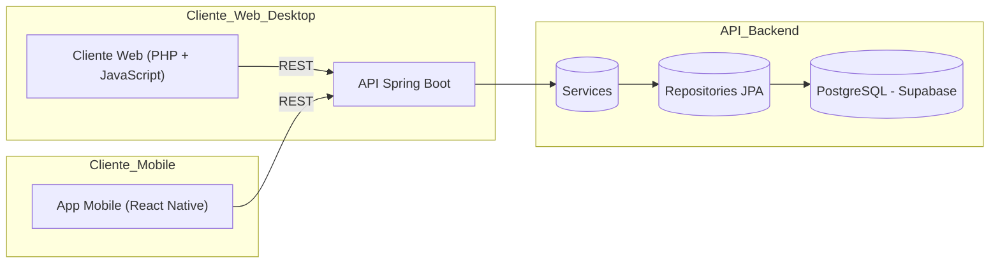
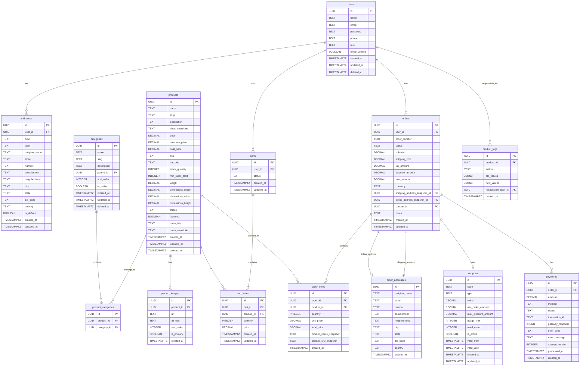

# Documentação Oficial do Projeto LaMusic

## 1. Visão Geral

**LaMusic** é um e-commerce de instrumentos musicais composto por três camadas principais:

1. **Banco de Dados PostgreSQL (Supabase)**
   - Armazena usuários, endereços, produtos, categorias, carrinhos, itens de carrinho, pedidos, itens de pedido, cupons e pagamentos.
2. **API Back-end em Java Spring Boot**
   - Realiza lógica de negócios, autenticação, autorização (RLS/Supabase Policies) e expõe endpoints REST.
3. **Cliente Mobile em React Native**
   - Consome endpoints da API para exibir catálogo, gerenciar carrinho, pedidos e, futuramente, módulo admin.

------

## 2. Arquitetura e System Design



**Deployment**:

- **Banco de Dados**: Supabase (PostgreSQL)
- **API Back-end**: Render.com via GitHub Actions (container Docker)
- **Cliente Web/Desktop**: desenvolvimento local em PHP + JavaScript; hospedagem futura a definir (ex.: Vercel, Netlify ou host PHP)
- **Cliente Mobile**: desenvolvimento local em React Native; distribuição futura via App Store / Play Store ou Expo

------

## 3. Schema de Banco de Dados

### 3.1 Diagrama ER (Mermaid)




### 3.2 Script SQL resumido


```sql
-- Habilitar extensão pgcrypto para UUIDs
CREATE EXTENSION IF NOT EXISTS "pgcrypto";

-- Exemplo da tabela users
CREATE TABLE users (
  id UUID PRIMARY KEY DEFAULT gen_random_uuid(),
  name TEXT NOT NULL,
  email TEXT UNIQUE NOT NULL,
  password TEXT NOT NULL,
  role TEXT NOT NULL DEFAULT 'customer' CHECK(role IN ('customer','admin')),
  created_at TIMESTAMPTZ NOT NULL DEFAULT now(),
  updated_at TIMESTAMPTZ NOT NULL DEFAULT now(),
  deleted_at TIMESTAMPTZ
);
-- Consulte /sql/schema.sql para o script completo
```

------

## 4. Estado Atual do MVP

- **Banco de Dados**: Schema refatorado com UUIDs, triggers de timestamps, tabelas novas (addresses, coupons, payments) e RLS pendente.
- **API Back-end**: Mapeamento JPA ainda no banco antigo (Long/IDENTITY), precisa migrar para UUID e novas entidades e relacionamentos.
- **Cliente Mobile**: Funcionalidades de login, listagem de produtos, carrinho e checkout implementadas.
- **Web Admin**: Protótipo de UI em React disponível; falta integração com API.

------

## 5. Backlog de Tarefas para MVP

| Nº   | Tarefa                                                       | Prioridade | Responsável     | Status       |
| ---- | ------------------------------------------------------------ | ---------- | --------------- | ------------ |
| 1    | Finalizar políticas RLS no Supabase                          | Alta       | Backend         | Em andamento |
| 2    | Migrar entidades JPA para novo schema (UUIDs e novas tabelas) | Alta       | Backend         | Pendente     |
| 3    | Expor endpoints para CRUD de `addresses`, `coupons`, `payments` | Alta       | Backend         | Pendente     |
| 4    | Implementar módulo Admin (Web & Mobile) para CRUD de produtos e categorias | Média      | Fullstack/Admin | Planejado    |
| 5    | Ajustar mobile para consumir novos endpoints  | Média      | Mobile          | Pendente     |
| 6    | Testes de integração e cobertura ≥ 80%                       | Baixa      | QA              | Não iniciado |
| 7    | Documentação Swagger/OpenAPI completa                        | Média      | Backend         | Não iniciado |
| 8    | Garantir deploy da API (Render via GitHub Actions)           | Alta       | DevOps/Backend  | Em produção  |
| 9    | Subir cliente Web (React Admin) em ambiente de hospedagem    | Alta      | Web             | Pendente     |
| 10   | Subir cliente Mobile (React Native) em ambiente de hospedagem | Alta      | Mobile/DevOps   | Pendente     |
| 11   | Analisar opções de hospedagem para Web e Mobile              | Baixa      | DevOps          | Planejado    |
| 12   | Rastrear alterações por user - Add campo Responsible          | Baixa      | Backend          | Planejado    |

------

## 6. Módulo Admin (Nova Feature)

### 6.1 Requisitos

- CRUD de **Produtos** (nome, descrição, preço, estoque, imagem, categorias).
- CRUD de **Categorias**.
- Autenticação: somente `role = admin` pode acessar.

### 6.2 Endpoints REST

- `GET    /admin/products`
- `POST   /admin/products`
- `PUT    /admin/products/{id}`
- `DELETE /admin/products/{id}`
- `GET    /admin/categories`
- `POST   /admin/categories`
- `PUT    /admin/categories/{id}`
- `DELETE /admin/categories/{id}`

> **Proteção**: usar RLS/Policies e/ou filtros de role na API.

### 6.3 UI

- **Web Admin** (React): Dashboard responsivo com tabelas e formulários.
- **Admin Mobile** (React Native): Telas de lista e detalhes/formulários.

------

## 7. Boas Práticas e Padrões

- **Versionamento**: GitFlow (`feature/*`, `develop`, `main`).
- **CI/CD**: GitHub Actions → build, test, deploy.
- **Documentação**: Swagger/OpenAPI; README no GitHub.
- **Testes**: Unitários (JUnit), integração (Testcontainers).
- **Monitoramento**: Logs centralizados (Supabase Logs, external ELK), métricas (Prometheus).
- **Segurança**: HTTPS, RLS no Supabase, validações no backend.

------

## 8. Links Úteis

- Repositório Back-end: https://github.com/vitorwhois/LaMusic
- Painel Supabase: https://app.supabase.com/project/...
- Swagger UI: https://api.lamusic.com/swagger-ui.html

